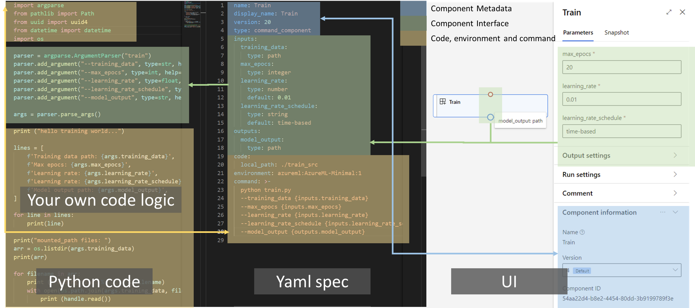

# What is an Azure Machine Learning component?
An Azure Machine Learning component (previously known as a module) is a self-contained piece of code that does one step in a machine learning pipeline. Components are the building blocks of advanced machine learning pipelines (see [Create and run machine learning pipelines with the Azure Machine Learning CLI](https://docs.microsoft.com/en-us/azure/machine-learning/how-to-create-component-pipelines-cli)). Components can do tasks such as data processing, model training, model scoring, and so on.

A component is analogous to a function - it has a name, parameters, expects input, and returns output. For more information on creating a component, see [create a component](https://docs.microsoft.com/en-us/azure/machine-learning/concept-component#define-a-component-preview).

## Why should I use a component?
Components let you manage and reuse common logic across pipelines.

- **Composable**: Components let developers hide complicated logic behind a simple interface. Component users don't have to worry about the underlying logic, they only need to provide parameters.

- **Share and reuse**: Components are automatically shared with users in the same workspace. You can reuse components across pipelines, environments, workspaces, and subscriptions. Built-in version-tracking lets you keep track of changes and reproduce results.

- **CLI support**: Use components to create pipelines in the CLI (v2).

## Define a component
To define an Azure Machine Learning component, you must provide two files:

- A component specification in the valid [YAML component specification format](https://docs.microsoft.com/en-us/azure/machine-learning/reference-yaml-component-command). This file specifies the following information:
  - Metadata: name, display_name, version, type, and so on.
  - Interface: inputs and outputs
  - Command, code, & environment: The command, code, and environment used to run the component
- A script to provide the actual execution logic.

### Component specification
The component specification file defines the metadata and execution parameters for a component. The component spec tells Azure Machine Learning how to run the Python script that you provide.

The following YAML example is a component specification for a training component.

```yaml
name: Example_Train
display_name: Example Train
version: 20
type: command
description: Example of a torchvision training component
tags: {category: Component Tutorial, contact: user@contoso.com}
inputs:
  training_data: 
    type: path
    description: Training data organized in torchvision structure
  max_epochs:
    type: integer
    description: Maximum epochs for training
  learning_rate: 
    type: number
    description: Learning rate, default is 0.01
    default: 0.01
  learning_rate_schedule: 
    type: string
    default: time-based 
outputs:
  model_output:
    type: path
code:
  local_path: ./train_src
environment: azureml:AzureML-Minimal:1
command: >-
  python train.py 
  --training_data ${{inputs.training_data}} 
  --max_epochs ${{inputs.max_epochs}}   
  --learning_rate ${{inputs.learning_rate}} 
  --learning_rate_schedule ${{inputs.learning_rate_schedule}} 
  --model_output ${{outputs.model_output}}
```

The following table explains the fields in the example. For a full list of available fields, see the [YAML component specification reference page](https://docs.microsoft.com/en-us/azure/machine-learning/reference-yaml-component-command).

| Name  | Type | Required | Description |
| ------------- | ------------- | ------------- | ------------- |
| name  | string | Yes | Name of the component. Must be a unique identifier of the component. Must start with number or letter, and only contain letters, numbers, `_`, and `-`. Maximum length is 255 characters. |
| version |	string | Yes | Version of the component. Must be a string.|
| display_name | string |	No | Display name of the component. Defaults to same as `name`. |
| type | string |	No | The type of the component. Currently, this value must be `command`. |
| description | string | No |	Detailed description of the component. |
| tags | Dictionary<string>	| No | A list of key-value pairs to describe different perspectives of the component. Each tag's key and value should be one word or a short phrase, for example, `Product:Office`, `Domain:NLP`, `Scenario:Image Classification`. |
| is_deterministic | boolean | No |	Whether the component will always generate the same result when given the same input data. The default is `True`. Should be set to `False` for components that will load data from external resources, for instance, importing data from a given url, since the data may be updated. |
| inputs | Dictionary<string, Input> | No |	Defines input ports and parameters of the component. The string key is the name of the input, which must be a valid Python variable name. |
| outputs | Dictionary<string, Output> | No |	Defines output ports of the component. The string key is the name of the output, which must be a valid Python variable name. |
| code | string |	No | Path to the source code. |
| environment |	Environment	| No | The runtime environment for the component to run. |
| command |	string | No |	The command to run the component code. |

### Python script
Your Python script contains the executable logic for your component. Your script tells Azure Machine Learning what you want your component to do.

To run, you must match the arguments for your Python script with the arguments you defined in the YAML specification. The following example is a Python training script that matches the YAML specification from the previous section.

```python
## Required imports 
import argparse
import os
## Import other dependencies your script needs
from pathlib import Path
from uuid import uuid4
from datetime import datetime

## Define an argument parser that matches the arguments from the components specification file
parser = argparse.ArgumentParser("train")
parser.add_argument("--training_data", type=str, help="Path to training data")
parser.add_argument("--max_epochs", type=int, help="Max # of epochs for the training")
parser.add_argument("--learning_rate", type=float, help="Learning rate")
parser.add_argument("--learning_rate_schedule", type=str, help="Learning rate schedule")
parser.add_argument("--model_output", type=str, help="Path of output model")

args = parser.parse_args()

## Implement your custom logic (in this case a training script)
print ("hello training world...")

lines = [
    f'Training data path: {args.training_data}',
    f'Max epochs: {args.max_epochs}',
    f'Learning rate: {args.learning_rate}',
    f'Learning rate: {args.learning_rate_schedule}',
    f'Model output path: {args.model_output}',
]

for line in lines:
    print(line)

print("mounted_path files: ")
arr = os.listdir(args.training_data)
print(arr)

for filename in arr:
    print ("reading file: %s ..." % filename)
    with open(os.path.join(args.training_data, filename), 'r') as handle:
        print (handle.read())

## Do the train and save the trained model as a file into the output folder.
## Here only output a dummy data for example.
curtime = datetime.now().strftime("%b-%d-%Y %H:%M:%S")
model = f"This is a dummy model with id: {str(uuid4())} generated at: {curtime}\n"
(Path(args.model_output) / 'model.txt').write_text(model)
```



## Create a component
### Create a component using CLI (v2)
After you define your component specification and Python script files, and [install CLI (v2) successfully](https://docs.microsoft.com/en-us/azure/machine-learning/how-to-configure-cli), you can create the component in your workspaces using:
  
```bash
az ml component create --file my_component.yml --version 1 --resource-group aml-resource-group --workspace-name aml-workspace
```
  
Use `az ml component create --help` for more information on the `create` command.

Optionally, setup common variables in your shell for usage in subsequent commands:
  
```bash
GROUP="aml-resource-group"
LOCATION="westeurope"
WORKSPACE="aml-workspace"
```

Now a new component can be created as follows:
  
```bash
az ml component create --file component.yaml --version 1 --resource-group $GROUP --workspace-name $WORKSPACE
```

## Use components to build ML pipelines
You can use the Azure CLI (v2) to create a pipeline job. See [Create and run ML pipelines (CLI)](https://docs.microsoft.com/en-us/azure/machine-learning/how-to-create-component-pipelines-cli).

## Manage components
You can check component details and manage the component using CLI (v2). Use the following command to get detailed instructions on component command.

```bash
az ml component -h
```
  
### List components
You can use the following command to list all components in a workspace.

```bash
az ml component list --resource-group $GROUP --workspace-name $WORKSPACE
```
  
### Show details for a component
You can use the following command to show the details of a component.

```bash
az ml component show --name <COMPONENT_NAME>
```

### Upgrade a component
You can use the following command to upgrade a component.

```bash
az ml component create --file <NEW_VERSION.yaml>
```
  
### Delete a component
You can use the following command to delete a component.

```bash
az ml component create --file <NEW_VERSION.yaml>
```

  


