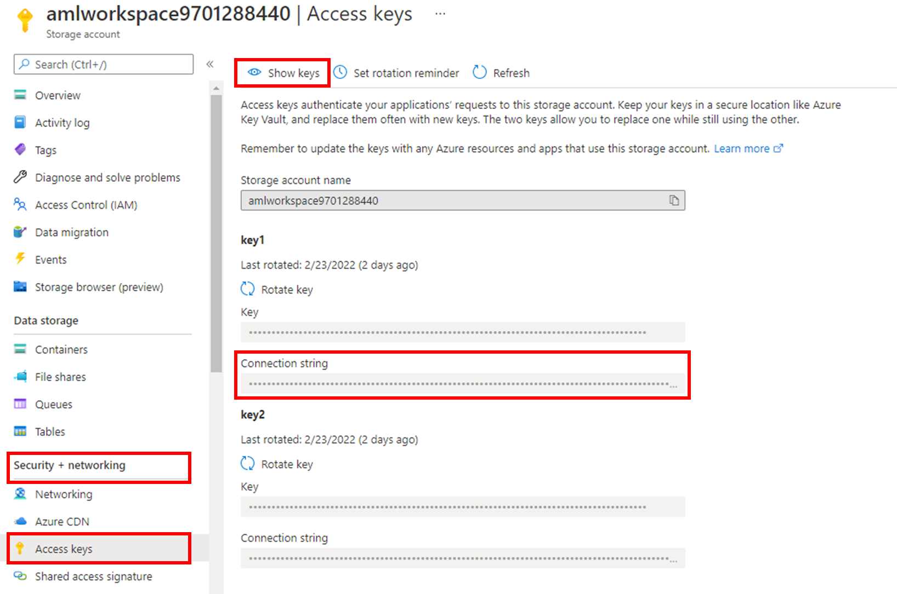

# Manage blobs with Python v12 SDK
In this quickstart, you learn to manage blobs by using Python. Blobs are objects that can hold large amounts of text or binary data, including images, documents, streaming media, and archive data. You'll upload, download, and list blobs, and you'll create and delete containers.

## Setting up
This section walks you through preparing a project to work with the Azure Blob Storage client library v12 for Python.

### Create the project
Create a Python application named *blob-quickstart-v12*.

1. In a console window (such as cmd, PowerShell, or Bash), create a new directory for the project.

    ```bash
    mkdir blob-quickstart-v12
    ```

2. Switch to the newly *created blob-quickstart-v12* directory.
    ```bash
    cd blob-quickstart-v12
    ```

3. In side the *blob-quickstart-v12 directory*, create another directory called *data*. This directory is where the blob data files will be created and stored.
    
    ```bash
    mkdir data
    ```

### Install the package
While still in the application directory, install the Azure Blob Storage client library for Python package by using the `pip install` command.

```bash
pip install azure-storage-blob
```

This command installs the Azure Blob Storage client library for Python package and all the libraries on which it depends. In this case, that is just the Azure core library for Python.

### Set up the app framework
From the project directory:

1. Open a new text file in your code editor
2. Add `import` statements
3. Create the structure for the program, including basic exception handling
    Here's the code:
    
    ```python
    import os, uuid
    from azure.storage.blob import BlobServiceClient, BlobClient, ContainerClient, __version__

    try:
        print("Azure Blob Storage v" + __version__ + " - Python quickstart sample")

        # Quick start code goes here

    except Exception as ex:
        print('Exception:')
        print(ex)
    ```
    
4. Save the new file as *blob-quickstart-v12.py* in the *blob-quickstart-v12* directory.

### Copy your credentials from the Azure portal
When the sample application makes a request to Azure Storage, it must be authorized. To authorize a request, add your storage account credentials to the application as a connection string. To view your storage account credentials, follow these steps:

1. Sign in to the [Azure portal](https://portal.azure.com/).
2. Locate your storage account.
3. In the storage account menu pane, under **Security + networking**, select **Access keys**. Here, you can view the account access keys and the complete connection string for each key.

4. In the **Access keys** pane, select **Show keys**.
5. In the **key1** section, locate the **Connection string** value. Select the **Copy to clipboard** icon to copy the connection string. You will add the connection string value to an environment variable in the next section.


    

### Configure your storage connection string
After you copy the connection string, write it to a new environment variable on the local machine running the application. To set the environment variable, open a console window, and follow the instructions for your operating system. Replace `<yourconnectionstring>` with your actual connection string.

### Linux
```bash
export AZURE_STORAGE_CONNECTION_STRING="<yourconnectionstring>"
```

### Restart programs
After you add the environment variable, restart any running programs that will need to read the environment variable. For example, restart your development environment or editor before you continue.

## Object model
Azure Blob Storage is optimized for storing massive amounts of unstructured data. Unstructured data is data that doesn't adhere to a particular data model or definition, such as text or binary data. Blob storage offers three types of resources:

- The storage account
- A container in the storage account
- A blob in the container

The following diagram shows the relationship between these resources.


Use the following Python classes to interact with these resources:

- [BlobServiceClient](https://docs.microsoft.com/en-us/python/api/azure-storage-blob/azure.storage.blob.blobserviceclient): The `BlobServiceClient` class allows you to manipulate Azure Storage resources and blob containers.
- [ContainerClient](https://docs.microsoft.com/en-us/python/api/azure-storage-blob/azure.storage.blob.containerclient): The `ContainerClient` class allows you to manipulate Azure Storage containers and their blobs.
- [BlobClient](https://docs.microsoft.com/en-us/python/api/azure-storage-blob/azure.storage.blob.blobclient): The `BlobClient` class allows you to manipulate Azure Storage blobs.

